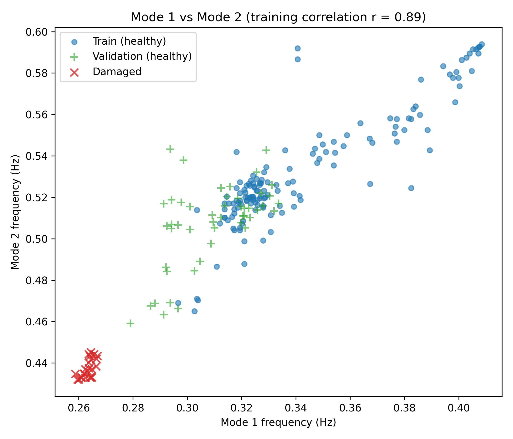
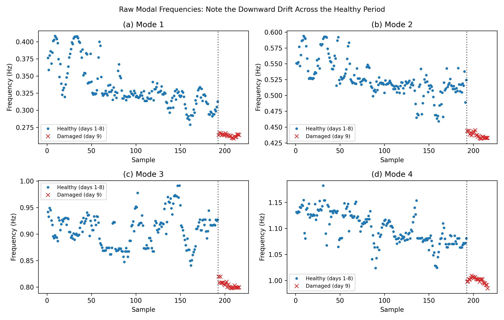
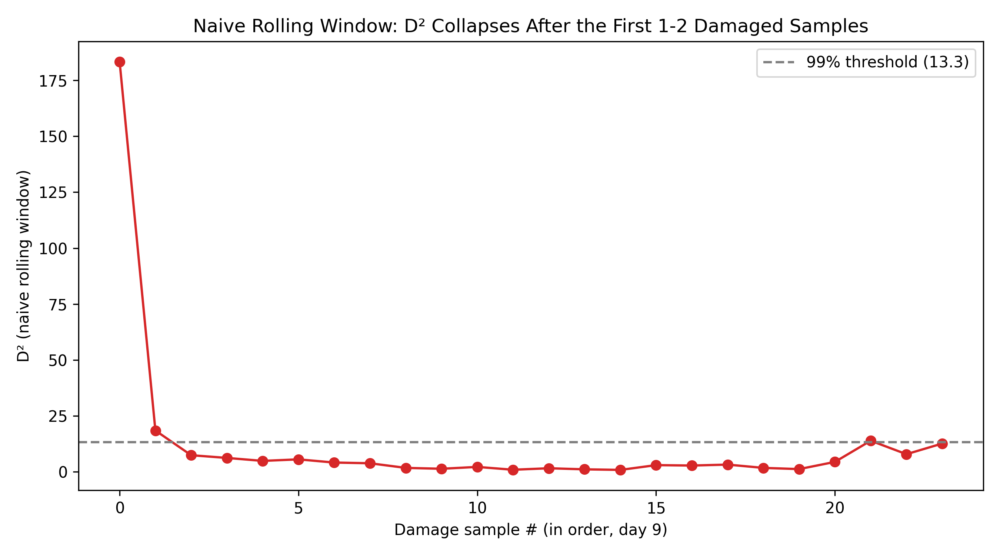
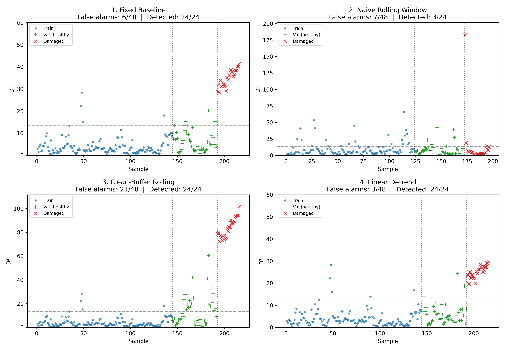

# Vibration-Based Structural Health Monitoring: A Comparison of Four Anomaly-Detection Strategies

This is a companion piece to a separate project,
[wave-propagation-damage-reflection](https://github.com/Opeyemi-Bamidele/wave-propagation-damage-reflection):
this project detects damage *statistically*, via shifts in modal
frequencies; the companion project investigates the underlying *physical
mechanism* of how a localized stiffness loss actually affects wave
propagation, via impedance mismatch and reflection.

## Setup & running

```bash
pip install -r requirements.txt
```

**Get the dataset** (not included in this repo — see licensing note below):
1. Download `Yonghe_Modal_FDD.mat` from the Mendeley Data record linked below
2. Place it in a `data/` folder at the repo root: `data/Yonghe_Modal_FDD.mat`

```bash
python shm.py
```

This single script runs all four methods in sequence and saves all five
figures to `figures/`.

## Dataset
- Source: Sarmadi, Hassan; Daneshvar, Mohammad Hassan (2022), “Structural Health Monitoring of A Cable-Stayed Bridge”, Mendeley    Data, V1, doi: 10.17632/2xnn95rpb5.1
- **Not included in this repository** — download directly from the link above
  (small file, freely available) and place it at `data/Yonghe_Modal_FDD.mat`.
   Cite the original authors if you use it.
- 4 modal frequencies (identified via Frequency Domain Decomposition), 216
  samples across 9 days of monitoring on the Yonghe Bridge. Samples 1–192:
  undamaged condition (days 1–8). Samples 193–216: damaged condition
  (day 9, July 31 2008).

## The core problem
Structural damage (cracking, loosened connections, stiffness loss) causes
measurable drops in a structure's natural vibration frequencies. But
frequencies also shift due to environmental effects, chiefly temperature 
that have nothing to do with damage. The central challenge in vibration-based
SHM is separating genuine damage signatures from this environmental "noise."

This project builds, tests, and compares **four different strategies** for
handling this problem, starting from first principles.

## The correlation structure (why Mahalanobis distance, not per-mode thresholds)
`figures/A_mode1_vs_mode2_correlation.png` shows Mode 1 vs Mode 2 for every
training sample: healthy points follow a clear diagonal trend (r = 0.89),
both modes rise and fall together, since both are driven by the same
underlying factor (overall structural stiffness, itself governed by
temperature). A simple per-mode threshold treats each mode independently
and cannot see this relationship. Mahalanobis distance explicitly encodes
it: a sample that breaks the normal Mode1-Mode2 relationship is flagged as
unusual even if neither individual value looks extreme on its own.



## Method 1 — Fixed-baseline Mahalanobis distance
A single mean vector (μ) and covariance matrix (Σ) are estimated from 144
training samples (75% of the healthy data). Every new sample's "distance"
from this baseline is measured via Mahalanobis distance,
$D^2 = (x-\mu)^T\Sigma^{-1}(x-\mu)$.

Anomalies are flagged using a 99% control limit derived from the
chi-square distribution (df = 4), the theoretical distribution of squared
Mahalanobis distances under a multivariate-normal assumption.

**Result: 6/48 false alarms on held-out healthy data, 24/24 damage detected.**

**Limitation identified:** `figures/C_raw_frequency_drift.png` shows all 4
modes' raw frequency tracks trending clearly downward across the healthy
monitoring period, almost certainly temperature-driven. A single fixed
baseline can't distinguish "drift" from "damage" — it just measures distance
from one static average, inflating scores for later healthy samples purely
due to environmental drift.



## Method 2 — Naive rolling-window Mahalanobis distance
To address the drift problem, μ and Σ are recomputed locally using only
the 20 samples immediately preceding each point (true time order, train →
val → damaged concatenated). This lets "normal" adapt as conditions change.

**Result: 7/48 false alarms, but only 3/24 damage detected.**

**Failure mechanism (diagnosed, not just observed):** the window adapts to
*whatever* came before it, with no distinction between healthy and damaged
history. Within 1–2 samples of damage onset, the window itself starts
containing damaged readings, and μ/Σ silently drift toward representing
"normal for a damaged structure." Subsequent damage looks unremarkable
relative to this contaminated baseline, the detector effectively "forgets"
that anything is wrong. `figures/D_naive_rolling_collapse.png` shows this
directly: D² spikes on the very first damaged sample, then collapses to
near-normal values within 1-2 samples and stays there.



## Method 3 — Clean-buffer rolling Mahalanobis distance
A fix for Method 2's contamination problem: the local buffer only updates
with samples that were **not** flagged as anomalous. Flagged samples are
excluded from ever entering the "normal" reference.

**Result: 24/24 damage detected (contamination problem solved), but 21/48
false alarms — worse than both previous methods.**

**Failure mechanism (diagnosed):** once a sample is falsely flagged (e.g.
from ordinary drift/noise crossing the threshold), the buffer freezes and
stops updating. But the environment keeps changing regardless — so the
buffer becomes increasingly stale, making subsequent samples look even
*more* anomalous relative to it, which keeps the buffer frozen. This
produces visible cascades of consecutive false alarms in the results
(clearly visible in the comparison figure). A long-frozen buffer
effectively degenerates back into a stale version of Method 1's original
problem.

## Method 4 — Linear detrending + fixed Mahalanobis distance
A different strategy entirely: rather than adapting the baseline over time,
fit a per-mode linear trend on the **training data only**, subtract it from
the entire dataset, and run the standard fixed-baseline method (Method 1)
on the residuals. If detrending works, residuals should scatter around a
constant level rather than trending, restoring the validity of a single
fixed baseline.

**Result: 3/48 false alarms, 24/24 damage detected — best of all four methods.**

Fitted slopes are physically interpretable: Modes 1, 2, and 4 show 
clear negative slopes (-0.00053, -0.00049, -0.00038;
consistent with temperature-driven softening), while Mode 3's slope is
nearly flat (+0.00004). This is consistent with the training covariance
matrix, where Mode 3 shows the weakest pairwise
covariance with the other three modes (-0.00004, -0.00010, 0.00011 — all
near zero, versus e.g. Mode1-Mode2's 0.00075) — i.e. Mode 3 was already the
least correlated with the others in the raw baseline analysis, and turns
out to also be the least sensitive to whatever environmental factor drives
the drift in the other three.

## Results summary

| Method | False alarms (val, /48) | Damage detected (/24) | Core weakness |
|---|---|---|---|
| 1. Fixed baseline | 6 | 24 | Vulnerable to environmental drift |
| 2. Naive rolling window | 7 | 3 | Absorbs sustained damage into baseline |
| 3. Clean-buffer rolling | 21 | 24 | Freezes on false alarms → stale-baseline cascades |
| 4. Linear detrend | 3 | 24 | Only handles *linear* drift; real drift may be nonlinear |

See `figures/E_all_methods_comparison.png` for a direct visual comparison of
all four methods on the same sample timeline.



## Honest limitations
- Small dataset (216 samples, single damage event) — results demonstrate
  methodology, not a validated production system.
- Only 4 modal-frequency features available — no raw time series or mode
  shapes, limiting feature engineering options.
- No environmental covariates (temperature, traffic) — the drift is inferred
  as temperature-driven by physical reasoning, not confirmed directly.
- Linear detrending is a simplification; real environmental effects are
  unlikely to be perfectly linear over time.
- The damage event here is severe enough (D² roughly 2–3× the threshold)
  that all methods except naive rolling detect it easily. A harder, more
  realistic test — progressive/graded damage — would better differentiate
  these methods' sensitivity to subtle damage. 

## Files
- `shm.py` — single script containing all four methods, run in sequence
  (fixed baseline → naive rolling window → clean-buffer rolling →
  linear detrend), plus all figure generation.
  Each method was designed and reasoned through — including the physical
  justification for Mahalanobis distance, the chi-square control limit,
  and the specific failure mechanisms of Methods 2 and 3 — before being
  implemented.
- `figures/` — all generated plots (created automatically when `shm.py` runs):
  - `A_mode1_vs_mode2_correlation.png` — motivates Mahalanobis distance over per-mode thresholds
  - `B_fixed_baseline_mahalanobis.png` — Method 1 result
  - `C_raw_frequency_drift.png` — motivates the whole project (Method 1's limitation)
  - `D_naive_rolling_collapse.png` — Method 2's failure mechanism, visualized
  - `E_all_methods_comparison.png` — all four methods side by side

## Development notes
Every method here was designed, reasoned through, and implemented from
first principles (mean/covariance estimation, the physical justification
for Mahalanobis distance over per-mode thresholds, the chi-square control
limit, and the specific failure mechanisms of Methods 2 and 3) before being
translated into code. Several real bugs were hit and debugged along the way
(row/column axis confusion when slicing, `array[:, :1]` vs `array[:, 0]`
producing a column-vector instead of a flat vector and silently breaking a
matrix multiplication, `list.append()` returning `None` and overwriting the
list it was called on), these are noted here deliberately, since debugging
one's own mistakes was as important to understanding the method as the
final working code.

## Related project
[wave-propagation-damage-reflection](https://github.com/Opeyemi-Bamidele/wave-propagation-damage-reflection)
— a finite-difference wave equation solver exploring the physical
mechanism behind the frequency shifts this project detects: how a
localized stiffness loss changes local wave speed, causing partial
reflection at the damage boundary (impedance mismatch). Together, the two
projects cover both the statistical detection side and the physical
mechanism side of vibration-based structural health monitoring.
